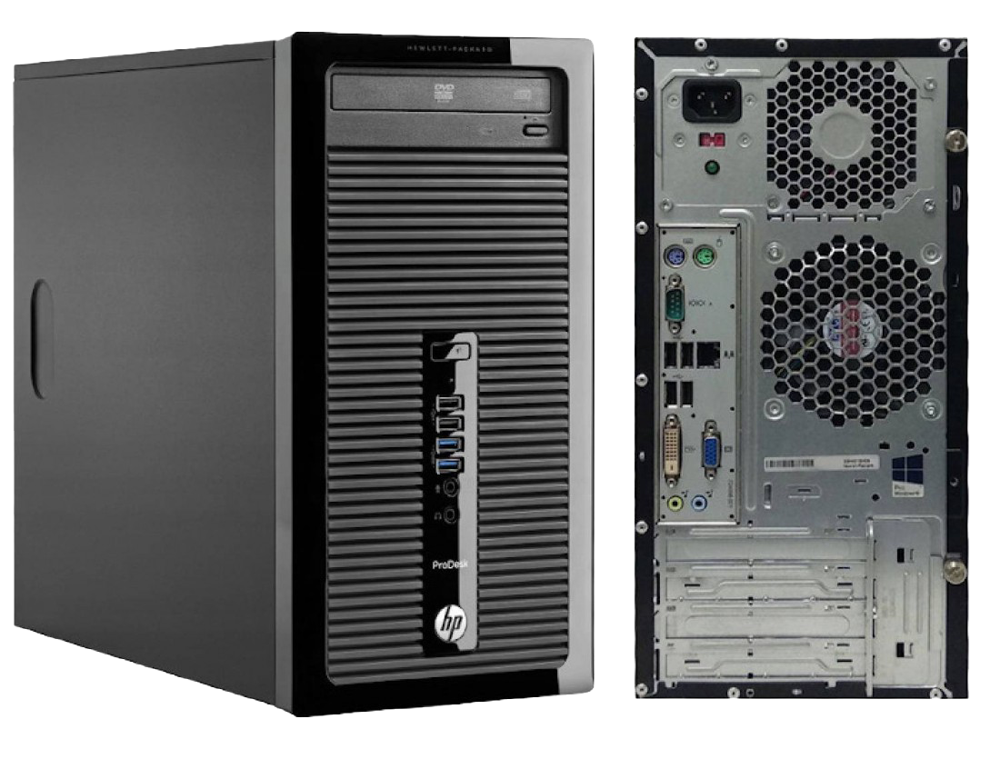

# Running every Intel-based macOS releases (from Mac OS X Tiger 10.4 to macOS Sonoma 14) on HP ProDesk 400 G1 (Haswell)

OpenCore-based EFI for HP ProDesk 400 G1 (Haswell)


**Status: Fully Working | Stable**

[](https://github.com/acidanthera/OpenCorePkg/releases/tag/1.0.0)

[](https://support.hp.com/us-en/document/c04496994)

[](https://www.apple.com/macos/sonoma/)
[](https://web.archive.org/web/20230925214840/https://www.apple.com/macos/ventura/)
[](https://www.apple.com/by/macos/monterey/)
[](https://web.archive.org/web/20211018064504/https://www.apple.com/macos/big-sur/)
[](https://web.archive.org/web/20201109035708/http://www.apple.com/macos/catalina/)
[](https://web.archive.org/web/20190901002230/https://www.apple.com/macos/mojave/)
[](https://web.archive.org/web/20180907061629/https://www.apple.com/macos/high-sierra/)
[](https://web.archive.org/web/20170830032643/https://www.apple.com/macos/sierra/)
[](https://web.archive.org/web/20160902012446/http://www.apple.com/osx/)
[](https://web.archive.org/web/20150828025125/http://www.apple.com/osx/)
[](https://web.archive.org/web/20141015031940/http://www.apple.com/osx/)
[](https://web.archive.org/web/20121231120319/http://www.apple.com/osx/)
[](https://web.archive.org/web/20120609062701/http://www.apple.com/macosx/)
[](https://web.archive.org/web/20090929063403/http://www.apple.com/macosx/)
[](https://web.archive.org/web/20090528055219/http://www.apple.com/macosx/)
[](https://web.archive.org/web/20060728031552/http://www.apple.com/macosx/)


## Table of Contents

- [Introduction](#introduction)
- [Summary](#summary)
	- [Features](#features)
	- [Hardware](#hardware)
	- [HCL](#hcl)
- [Build](#build)
	- [Processor](#processor)
	- [Graphic Card](#graphic-card)
	- [Storage](#storage)
	- [Ethernet](#ethernet)
	- [Audio](#audio)
	- [Bluetooth](#bluetooth)
- [Contents](#contents)
	- [This is a Guide!](#this-is-a-guide)
	- [This is not a Guide!](#this-is-not-a-guide)
	- [Working](#working)
	- [Not Working](#not-working)
	- [Software](#software)
	- [Kernel](#kernel)
	- [ACPI](#acpi)
	- [Kext](#kext)
	- [UEFI Drivers](#uefi-drivers)
	- [config.plist](#configplist)
	- [Other Repositories](#other-repositories)
	- [Credits](#credits)
	- [Screenshots](#screenshots)
- [Installation](#installation)
	- [UEFI Settings](#uefi-settings)
	- [macOS Installation](#macos-installation)

</br>

## Introduction

I was inspired to create this project when I was preparing macOS installers (from Mac OS X Tiger 10.4 to macOS Sonoma 14) in an external hard drive and I wanted to test those installers if they are working properly, I tried the recent macOS releases on my daily hackintosh [HP Z640](https://github.com/HJebbour/HP-Z640-Hackintosh/), but it only supports down to OS X El Capitan 10.11. I had an older machine (Core 2 Quad Kentsfield) but I only managed to run down to OS X Mountain Lion. I still wanted to test older Mac OS X (Tiger-Lion), and then I found this [repo](https://github.com/b00t0x/MSI-Z97M-Hackintosh-every-macOS/) about running all Intel macOS releases in a single computer, it motivates me to do the same because I thought of another computer I have, HP ProDesk 400 G1 (Haswell). From here the real fun starts, I needed to build a hackintosh that can run every Intel macOS releases from Mac OS X Tiger 10.4.10 to macOS Sonoma 14.5 with **ONE** EFI folder that runs all Intel macOS releases on the same computer.

This project was created from scratch using the [Dortania](https://dortania.github.io/getting-started/) guide specifically for the HP ProDesk 400 G1.

**DISCLAIMER:**
As you embark on your Hackintosh journey you are encouraged to **READ** the entire README and [Dortania](https://dortania.github.io/getting-started/) guides before you start.

This HP ProDesk 400 G1 Hackintosh project aims to be an all-in-one maintained hub for Opencore-based hackintoshes on the HP ProDesk G1 family. In short, this HP ProDesk 400 G1 Hackintosh is very stable and can be used as daily driver. I fully recommend this project to anyone looking for an old Mac Pro alternative.

You can find a wealth of knowledge on [Reddit](https://www.reddit.com/r/hackintosh/), [TonyMacX86](https://www.tonymacx86.com) or [Google](https://www.google.com).

Should you find an error, or improve anything, be it in the config itself or in the my documentation, please consider opening an issue or a pull request to contribute.

**I am not responsible for any damages you may cause.**

</br>

## Summary

### Features

- Same **hardware** configuration: No need to swap GPU cards, Ethernet cards.
- Same **BIOS** configuration: No need to change BIOS configuration to run a specific macOS version.
- Same **connectors**: No need to switch video output, LAN, USB to run a specific macOS version.
- Same **bootloader**: No need to use different bootloader like Chameleon or Clover for older macOS versions. OpenCore covers all Intel macOS releases.
- Same **config.plist**: No need to have multiple config.plist to run specific macOS versions.

</br>

### Hardware

#### HP ProDesk 400 G1
These are relevant components on my machine which may differ from yours, keep these in mind as you will need to adjust accordingly, depending on your machine's configuration.

| Category  | Component                                       |
| --------- | ----------------------------------------------- |
| Processor | Intel Core i7-4770 (3.40 GHz) |
| Graphic Card | NVIDIA Quadro FX 5600 1536 MB (G80) |
| Storage | 2TB SATA SSD, 128GB SATA SSD, and 32GB USB flash drive |
| Memory | 8 GB 1600 MHz DDR3 |
| Ethernet | Realtek RTL8151GH-CG |
| Audio | Realtek ALC221 |
| Bluetooth | CSR8510 A10 4.0 |
| BIOS | 2.56 Rev.A (30/04/2019) |

</br>

### HCL
This is an overview of hardware compatibility list for all Intel-based macOS.

| macOS | i7-4770 | AHCI SATA SSD | Quadro FX 5600 | RTL8151GH-CG | ALC221 | CSR8510 A10 4.0 |
| :------------: | :------------: | :------------: | :------------: | :------------: | :------------: | :------------: |
| Sonoma | ✅ | ✅ | 5️⃣ | ✅ | ✅ | ✅ |
| Ventura | ✅ | ✅ | 5️⃣ | ✅ | ✅ | ✅ |
| Monterey | ✅ | ✅ | 5️⃣ | ✅ | ✅ | ✅ |
| Big Sur | ✅ | ✅ | 5️⃣ | ✅ | ✅ | ✅ |
| Catalina | ✅ | ✅ | 4️⃣ | ✅ | ✅ | ✅ |
| Mojave | ✅ | ✅ | 3️⃣ | ✅ | ✅ | ✅ |
| High Sierra | ✅ | ✅ | ✅ | ✅ | ✅ | ✅ |
| Sierra | ✅ | ✅ | ✅ | ✅ | ✅ | ✅ |
| El Capitan | ✅ | ✅ | ✅ | ✅ | ✅ | ✅ |
| Yosemite | ✅ | ✅ | ✅ | ✅ | ✅ | ✅ |
| Mavericks | ✅ | ✅ | ✅ | ✅ | ✅ | ✅ |
| Mountain Lion | ✅ | ✅ | ✅ | ✅ | ✅ | ✅ |
| Lion | 1️⃣ | ✅ | ✅ | ✅ | ✅ | ✅ |
| Snow Leopard | 1️⃣ | ✅ | ✅ | ✅ | ✅ | ✅ |
| Leopard | ✅ | ✅ | ✅ | ✅ | 6️⃣ | ✅ |
| Tiger | ✅ | 2️⃣ | ✅ | ✅ | 6️⃣ | ✅ |

1️⃣ Spoof CPUID to Nehalem (`0x0106A2`)

2️⃣ Install Mac OS X Tiger on a USB drive

3️⃣ Install [Old NVIDIA macOS Mojave](https://github.com/chris1111/Fix-Old-NVIDIA-macOS-Mojave?tab=readme-ov-file) from [chris1111](https://github.com/chris1111)

4️⃣ Install [Legacy Video Patch](https://github.com/chris1111/Legacy-Video-patch) from [chris1111](https://github.com/chris1111)

5️⃣ Install [OpenCore Legacy Patcher](https://github.com/dortania/OpenCore-Legacy-Patcher)

6️⃣ Use a USB DAC headset/speaker

</br>

## Build

### Processor

The beauty of the Intel 4th Gen Core Series is that it is old enough to run Mac OS X Tiger 10.4 and recent enough to run macOS Sonoma natively. Although it needs a custom kernel in Mac OS X Tiger 10.4, and spoof CPUID to Nehalem for Mac OS X Snow Leopard 10.6 and Lion 10.7.

</br>

### Graphic Card

This is the tricky part. I needed a GPU that is natively compatible with Tiger and can be patched with OCLP in Sonoma. I checked Dortania GPU Buyers Guide both the [Legacy AMD](https://dortania.github.io/GPU-Buyers-Guide/legacy-gpus/legacy-amd.html#hd-6000-series-6xxx/) and [Legacy Nvidia](https://dortania.github.io/GPU-Buyers-Guide/legacy-gpus/legacy-nvidia.html/).

- For AMD, I found that the HD 2000 Series are supported natively from 10.4 to 10.13, I tested AMD Radeon HD 2400 XT but it didn't work with any of the supposed supported macOS versions, it turns out legacy AMD GPUs are a hit or a miss even if they are officially supported by Apple, unlike Nvidia legacy should work properly if you [patch](https://dortania.github.io/OpenCore-Post-Install/gpu-patching/nvidia-patching/) your GPU in DeviceProperties.

- I bought an NVIDIA Quadro FX 5600 that is compatible with Mac OS X Leopard through macOS High Sierra according to [Dortania](https://dortania.github.io/GPU-Buyers-Guide/legacy-gpus/legacy-nvidia.html#geforce-8-8xxx-series) but, apparently this GPU is also compatible with Mac OS X Tiger if you use `NVinject.kext`. Indeed after using this GPU with `NVinject.kext`, NVIDIA legacy patching, and OCLP, it worked with all Intel macOS releases.
The [G80 NVIDIA Tesla GPUs](https://www.techpowerup.com/gpu-specs/?gpu=G80) are the best suited for this kind of hackintosh, GeForce 8800 GTS 320/640 and Quadro FX 5600 are known to be working.

- **Please note that legacy GPUs needs CSM/Legacy Boot turned on in the BIOS settings, otherwise you will have a blank screen when you boot the computer.**

- If you don't want to buy an older GPU you can use the iGPU (Intel HD 4600), which is supported from OS X Mountain Lion 10.8 up-to macOS Monterey 12, and can be used on macOS Ventura and Sonoma with OCLP. On Mac OS X Lion 10.7 and earlier it runs fine but without hardware acceleration (QE/CI).

- **Fun fact:** If you install Mac OS X Tiger, Leopard, and/or Snow Leopard from another Mac OS X using "OSInstall.mpkg" you will get the welcome video intro without a compatible GPU (hardware acceleration).

</br>

### Storage

- The first issue with storage is that AHCI causes a kernel panic with Mac OS X Tiger, so I had to disable `AppleAHCIPort` in the config.plist file and install Tiger on a USB flash drive.
- The second issue, it is a weird one! 1/2 times OS X Mountain Lion doesn't detect my 2TB SSD and thus I got stuck at "Waiting for root device", I installed Mountain Lion on a 128 GB SSD.
- The other macOS releases can be installed on any SATA SSD without any issues.

</br>

### Ethernet

It is a bit complicated to get my Ethernet (Realtek RTL8151GH-CG) working on all macOS versions. I had to use three different kexts:
- [RealtekR1000](https://sourceforge.net/projects/realtekr1000/) for Mac OS X Tiger and Leopard while forcing `IONetworkingFamily`.
- [Realtek RTL8111 v1.2.3](https://bitbucket.org/RehabMan/os-x-realtek-network/downloads/RehabMan-Realtek-Network-2014-1016.zip) for Mac OS X Snow Leopard up to macOS High Sierra while forcing `IONetworkingFamily` for Mac OS X Snow Leopard up to Yosemite.
- [RealtekRTL8111 v2.4.2](https://github.com/Mieze/RTL8111_driver_for_OS_X/releases/tag/2.4.2) for macOS Mojave and later.

</br>

### Audio

On-board audio Realtek ALC221:
- Not working on Mac OS X Leopard and Tiger! Consider using a USB DAC headset/speaker for audio funcionality.
- Working on Mac OS X Snow Leopard and Lion using [VoodooHDA-FAT](https://github.com/khronokernel/Legacy-Kexts/blob/master/FAT/Zip/VoodooHDA.kext.zip)
- Working on OS X Mountain Lion and later using `AppleALC` with layout-id 11.

</br>

### Bluetooth

CSR8510 A10 4.0 USB dongle:
- Works natively on Mac OS X Tiger until macOS Big Sur.
- `BlueToolFixup.kext` is required on macOS Monterey and later.

</br>

## Contents

### This is not a Guide!

This is not a guide. It shoud only be used as a reference or if you have the exact same machine. I provide some tips and tricks I learned on my journey in building a hackintosh. The best way of using this is as a supplement to the OpenCore guide. If you have questions about how to setup your specific hardware, are unclear about what to do, or would like to see the settings I've used.

I understand that some may simply add the OC and Boot folders to their EFI folder. For clarity the EFI partition needs a folder called EFI that contains the Boot and OC folder.

```EFI
EFI (drive)
	EFI
	├── BOOT
	├── OC
```

It should work and your HP ProDesk 400 G1 should boot and work fine. **You will at minimum need to generate SMBIOS values if you want Apple services to work.** Note that all error reporting/logging has been turned off in the config.plist. You will have a difficult time trouble shooting with the setup provided. You can easily turn on the error reporting and logging if you follow the [Dortania](https://dortania.github.io/OpenCore-Install-Guide/troubleshooting/debug.html) guide. Best of luck.

> **NOTE** if you simply wish to copy my EFI please do the following:
>
>1. [Generate SMBIOS values](https://dortania.github.io/OpenCore-Install-Guide/config-laptop.plist/coffee-lake-plus.html#nvram) and add them in the config.plist (Use specific SMBIOS depending on which macOS you want to install, see below for more info)
>2. Ensure the value of `showpicker` is  `true` in the config.plist file to provide the opencore menu when booting. 
>3. Prepare your install [USB](https://dortania.github.io/OpenCore-Install-Guide/installer-guide/)
>4. Move the entire EFI folder (with your modifications) to the proper partition on your [USB](https://dortania.github.io/OpenCore-Install-Guide/installer-guide/mac-install.html#setting-up-opencore-s-efi-environment) (or [SSD](https://dortania.github.io/OpenCore-Post-Install/universal/oc2hdd.html) once the install is complete).
>5. [Install](https://dortania.github.io/OpenCore-Install-Guide/installation/installation-process.html#double-checking-your-work) - You'll need to select F9 to get the boot menu options and **boot from the USB each time the computer restarts** until you've copied the EFI folder onto the hard drive. You may also need to select the correct boot option during install.

</br>

### This is a Guide!

**If you have a slightly different computer you should follow the one and only guide to install macOS, provided by [Dortania](https://dortania.github.io/OpenCore-Install-Guide/)**

</br>

### Working

> #### Video and Audio
| Feature                              | Status | Dependency          | Remarks                      |
| :----------------------------------- | ------ | ------------------- | ---------------------------- |
| Full Graphics Accleration (QE/CI) | ✅ | `NVinject.kext`, `WhateverGreen.kext`, and NVIDIA legacy patching `NVCAP` | NVIDIA Quadro FX 5600 is natively supported on Mac OS X Tiger up to macOS High Sierra, and needs patchers with macOS Mojave and later |
| Audio Output (Front/Back) | ✅ | `SSDT-HPET.aml`, `AppleALC.kext` with Layout ID = 11 and `VoodooHDA-FAT.kext` | Not working on Mac OS X Tiger and Leopard |
| Audio Input (Front/Back) | ✅ | `SSDT-HPET.aml`, `AppleALC.kext` with Layout ID = 11 and `VoodooHDA-FAT.kext | Not working on Mac OS X Tiger and Leopard |
| Internal Speaker | ✅ | `SSDT-HPET.aml`, `AppleALC.kext` with Layout ID = 11 and `VoodooHDA-FAT.kext | Not working on Mac OS X Tiger and Leopard |
| Automatic Headphone Output Switching | ✅ | `SSDT-HPET.aml`, `AppleALC.kext` with Layout ID = 11 and `VoodooHDA-FAT.kext | Not working on Mac OS X Tiger and Leopard |
| DRM | ✅ | dGPU | - |

> #### Power Management
| Feature                              | Status | Dependency          | Remarks                      |
| :----------------------------------- | ------ | ------------------- | ---------------------------- |
| CPU Power Management | ✅ | `SSDT-PLUG.aml` | Not working on Mac OS X Tiger and Leopard |
| Sleep / Wake | ✅ | - | Not working on Mac OS X Tiger and Leopard |

> #### Connectivity
| Feature                              | Status | Dependency          | Remarks                      |
| :----------------------------------- | ------ | ------------------- | ---------------------------- |
| Bluetooth | ✅ | `BlueToolFixup.kext` | CSR 4.0 Bluetooth USB dongle is natively supported on Mac OS X Tiger until macOS Big Sur, `BlueToolFixup.kext` is needed on macOS Monterey and later |
| Ethernet | ✅ | `RealtekR1000.kext`, `RealtekRTL8111-SL.kext`, and `RealtekRTL8111.kext` | - |
| USB 2.0 / USB 3.0 | ✅ | `USBMap.kext` | Create your own USBMap.kext using [CorpNewt](https://github.com/corpnewt/USBMap) |

> #### Miscellaneous
| Feature                              | Status | Dependency          | Remarks                      |
| :----------------------------------- | ------ | ------------------- | ---------------------------- |
| Multiple Boot | ✅ | - | macOS, Windows, and Linux distributions (Use [this](https://dortania.github.io/OpenCore-Multiboot/empty/samedisk.html#precautions) guide to setup dual boot on the same drive) |
| Boot chime | ✅ | - | Working like a charme |

</br>

### Not Working

**Everything is working!**

</br>

### Software

| Component      | Version |
| -------------- | ------- |
| OpenCore | 1.0.0 |
| OpenCore Legacy Patcher | 1.5.0 |
| macOS Sonoma | 14.5 (23F79) |
| macOS Ventura | 13.6.7 (22G720) |
| macOS Monterey | 12.7.5 (21H1222) |
| macOS Big Sur | 11.7.10 (20G1427) |
| macOS Catalina | 10.15.7 (19H15) |
| macOS Mojave | 10.14.6 (18G103) |
| macOS High Sierra | 10.13.6 (17G66) |
| macOS Sierra | 10.12.6 (16G29) |
| OS X El Capitan | 10.11.6 (15G31) |
| OS X Yosemite | 10.10.5 (14F27) |
| OS X Mavericks | 10.9.5 (13F34) |
| OS X Mountaion Lion | 10.8.5 (12F37) |
| Mac OS X Lion | 10.7.5 (11G63) |
| Mac OS X Snow Leopard | 10.6.8 (10K549) |
| Mac OS X Leopard | 10.5.8 (9L31a) |
| Mac OS X Tiger | 10.4.11 (8S2167) |

</br>

### Kernel

Mac OS X Tiger cannot run on this computer with vanilla mach_kernel, it needs a custom kernel from the early hackintosh distros. I used [8.9.1 kernel SSE3 apr18]() custom kernel extracted from [XxX OS x86 10.4.11](https://archive.org/details/xxxosx8610point4point11rev2_202007)

Then, we need to replace it with the vanilla `mach_kernel` found on Mac OS X Tiger Installer, on the drive after installation, and after apply each update before rebooting, otherwise you can't boot Mac OS X Tiger.

</br>

### ACPI

| Component              | Description            |
| ---------------------- | ---------------------- |
| SSDT-EC | Fixes the embedded controller |
| SSDT-PLUG | Allows for native CPU power management |
| SSDT-HPET | Used for resolving IRQ conflicts (Fixing Audio issue with AppleALC) |

</br>

### Kext

| Kext                   | Version | Description |
| ---------------------- | ------- | ------- |
| Lilu | 1.6.7 | Used for arbitrary kext, library, and program patching on Mac OS X Snow Leopard and later only, due to kernel panic on 32-bit only kernels |
| VirtualSMC | 1.3.2 | Used to emulate Apple SMC in the kernel on Mac OS X Snow Leopard and later only, due to kernel panic on 32-bit only kernels |
| FakeSMC-32 | 2.5 | Used to emulate Apple SMC on Mac OS X Tiger and Leopard (32-bit only kernels) |
| NVinject | 0.0.10c | Used to enable graphics acceleration on Mac OS X Tiger |
| WhateverGreen | 1.6.6 | Used to patch GPU on Mac OS X Snow Leopard and later |
| VoodooHDA-FAT | - | Used to enable onboard audio on Mac OS X Snow Leopard and Lion |
| AppleALC | 1.9.0 | Used to enable onboard audio on OS X Mountain Lion and later |
| RealtekR1000 | 1.0.4 | Used to enable ethernet on Mac OS X Tiger and Leopard |
| RealtekRTL8111-SL | 1.2.3 | Used to enable ethernet on Mac OS X Snow Leopard through macOS High Sierra |
| RealtekRTL8111 | 2.4.2 | Used to enable ethernet on macOS Mojave and later |
| USBMap | - | Used to map USB ports on all macOS releases |
| BlueToolFixup | 2.6.8 | Used to enable USB Bluetooth dongle support on macOS Monterey and later |
| AMFIPass | 1.4.0 | Used to enable OpenCore Legacy Patcher on macOS Big Sur and later |
| SMCSuperIO | 1.3.2 | Used to monitor fan speed on Mac OS X Snow Leopard and later |
| SMCProcessor | 1.3.2 | Used to monitor Intel CPU temperature on Mac OS X Lion and later |
| RestrictEvents | 1.1.3 | Used to patch various functions on macOS Big Sur and later |

</br>

### UEFI Drivers

|     Driver      | Version           | Description       |
| --------------- | ----------------- | ----------------- |
| OpenRuntime | OpenCorePkg 1.0.0 | Essentiel to patch boot.efi for NVRAM fixes |
| AudioDxe | OpenCorePkg 1.0.0 | Enable Boot Chime |
| OpenCanopy | OpenCorePkg 1.0.0 | Enable graphical boot picker |
| OpenHfsPlus | OpenCorePkg 1.0.0 | Required to see HFS volumes (macOS Installers and Recovery partitions |
| OpenPartitionDxe | OpenCorePkg 1.0.0 | Required to load installers and recovery on OS X Mavericks and earlier |
| ResetNvramEntry | OpenCorePkg 1.0.0 | Allow to reset NVRAM from boot picker |
| ToggleSipEntry | OpenCorePkg 1.0.0 | Allow to toggle SIP from boot picker |

</br>

### config.plist

The following `config.plist` has been optimized to boot every Intel-based macOS releases to this date without extra Quirks and patches. The settings provided are specific to the HP ProDesk 400 G1 and may not be applicable to your computer.

Please refer to [Dortania's OpenCore Install Guide](https://dortania.github.io/OpenCore-Install-Guide/) and [OpenCore Reference Manual](https://dortania.github.io/docs/latest/Configuration.html) to adjust your `config.plist` to your system.

In this section I am going to explain every setting used in `config.plist` to give you an overview about this hackintosh.

<details> 
<summary><strong>ACPI</strong></summary>

#### Add
`SSDT-EC.aml`

`SSDT-PLUG.aml`

`SSDT-HPET.aml`

#### Patch
These patches are generated when choosing SSDT-HPET patch with SSDTTime.

| Find            | Replace         | Comment                 |
| --------------- | --------------- | ----------------------- |
| 0014275F 535441 | 00142758 535441 | HPET_STA to XSTA Rename |
| 055F4352 53     | 05584352 53     | HPET_CRS to XCRS Rename |
| 22040079 00     | 22000079 00     | IPIC IRQ 2 Patch        |
| 22000179 00     | 22000079 00     | RTC IRQ 8 Patch         |
| 22010079 00     | 22000079 00     | TIMR IRQ 0 Patch        |

</details>

<details> 
<summary><strong>Booter</strong></summary>

#### Patch
Because `-no_compat_check` disables system updates, it is better to apply this [patch](https://github.com/dortania/OpenCore-Legacy-Patcher/blob/432736eb98d7f8f69b5db229fcec861aceb356a4/payloads/Config/config.plist#L220-L267) from OpenCore Legacy Patcher.

| Comment                  | Find                                                                                           | Replace                                                                                        |
| ------------------------ | ---------------------------------------------------------------------------------------------- | ---------------------------------------------------------------------------------------------- |
| Skip Board ID check      | 0050006C 00610074 0066006F 0072006D 00530075 00700070 006F0072 0074002E 0070006C 00690073 0074 | 002E002E 002E002E 002E002E 002E002E 002E002E 002E002E 002E002E 002E002E 002E002E 002E002E 002E |
| Reroute HW_BID to OC_BID | 48005700 5F004200 49004400                                                                     | 4F004300 5F004200 49004400                                                                     |

References:
* https://github.com/5T33Z0/OC-Little-Translated/tree/main/09_Board-ID_VMM-Spoof
* https://dortania.github.io/OpenCore-Legacy-Patcher/PATCHEXPLAIN.html#opencore-settings

#### Quirks
The following Quirks are used:

- `AllowRelocationBlock`: Required to boot Mac OS X Lion 10.7 and earlier when CSM/Legacy Boot is turned on in BIOS.

- `AvoidRuntimeDefrag`: Fixes UEFI runtime services like date, time, NVRAM, power control, etc.

- `EnableSafeModeSlide`: Enables slide variables to be used in safe mode, however this quirk is only applicable to UEFI platforms.

- `EnableWriteUnprotector`: Needed to remove write protection from CR0 register.

- `RebuildAppleMemoryMap`: Required for Mac OS X Snow Leopard 10.6 and earlier.

- `SetupVirtualMap`: Fixes SetVirtualAddresses calls to virtual addresses.

</details>

<details> 
<summary><strong>DeviceProperties</strong></summary>

Use your own patch if you have a different GPU using [this](https://dortania.github.io/OpenCore-Post-Install/gpu-patching/nvidia-patching) guide. However, this patch is not effective for Mac OS X Tiger 10.4, `NVinject.kext` is required.

#### PciRoot(0x0)/Pci(0x1,0x0)/Pci(0x0,0x0)

| Key            | Value                                        | String   |
| -------------- | -------------------------------------------- | -------- |
| @0,compatible  | NVDA,NVMac                                   | `STRING` |
| @0,device_type | display                                      | `STRING` |
| @0,name        | NVDA,Display-A                               | `STRING` |
| @1,compatible  | NVDA,NVMac                                   | `STRING` |
| @1,device_type | display                                      | `STRING` |
| @1,name        | NVDA,Display-B                               | `STRING` |
| NVCAP          | 05000100 10000300 0C000000 0000000F 00000000 | `DATA`   |
| VRAM,totalsize | 00000060                                     | `DATA`   |
| device_type    | NVDA,Parent                                  | `STRING` |
| model          | NVIDIA Quadro FX 5600                        | `STRING` |
| rom-revision   | 1536.071010                                  | `STRING` |

</details>

<details> 
<summary><strong>Kernel</strong></summary>

#### Add
Adding Kexts with MinKernel and MaxKernel, and Arch type to allow booting all macOS releases from the same EFI folder.

Please refer to the [Kernel Support Table](https://dortania.github.io/OpenCore-Install-Guide/config.plist/haswell.html#add-3).

| Arch   | BundlePath             | MinKernel | MaxKernel |
| ------ | ---------------------- | --------- | --------- |
| x86_64 | Lilu.kext              | 10.0.0    |           |
| x86_64 | VirtualSMC.kext        | 10.0.0    |           |
| i386   | FakeSMC-32.kext        | 8.0.0     | 9.99.99   |
| i386   | NVinject.kext          | 8.0.0     | 8.99.99   |
| x86_64 | WhateverGreen.kext     | 10.0.0    |           |
| x86_64 | VoodooHDA-FAT.kext     | 10.0.0    | 11.99.99  |
| x86_64 | AppleALC.kext          | 12.0.0    |           |
| i386   | RealtekR1000.kext      | 8.0.0     | 9.99.99   |
| x86_64 | RealtekRTL8111-SL.kext | 10.0.0    | 17.99.99  |
| x86_64 | RealtekRTL8111.kext    | 18.0.0    |           |
| Any    | USBMap.kext            |           |           |
| x86_64 | BlueToolFixup.kext     | 21.0.0    |           |
| x86_64 | AMFIPass.kext          | 20.0.0    |           |
| x86_64 | SMCSuperIO.kext        | 10.0.0    |           |
| x86_64 | SMCProcessor.kext      | 11.0.0    |           |
| x86_64 | RestrictEvents.kext    | 20.0.0    |           |

#### Block
Blocking kexts to avoid kernel panic on Mac OS X Tiger 10.4 and Mac OS X Leopard 10.5. This results in AHCI being unusable in Mac OS X Tiger 10.4, requiring to install it on an USB drive.

| Arch | Identifier                     | MinKernel | MaxKernel | Strategy  |
| ---- | ------------------------------ | --------- | --------- | --------- |
| i386 | com.apple.driver.AppleAHCIPort | 8.0.0     | 8.99.99   | Disable   |
| i386 | com.apple.driver.EFIRuntime    | 8.0.0     | 9.99.99   | Disable   |

#### Force
Force loading `IONetworkingFamily.kext` to allow Ethernet to work on OS X Yosemite 10.10 and earlier.

| Arch | BundlePath                                        | Identifier                         | ExecutablePath                    | PlistPath           | MinKernel | MaxKernel |
| ---- | ------------------------------------------------- | ---------------------------------- | --------------------------------- | ------------------- | --------- | --------- |
| Any  | System/Library/Extensions/IONetworkingFamily.kext | com.apple.iokit.IONetworkingFamily | Contents/MacOS/IONetworkingFamily | Contents/Info.plist | 8.0.0     | 14.99.99  |

#### Patch
`DummyPowerManagement` is required for Mac OS X Snow Leopard 10.6.6 and earlier (10.6.7 and 10.6.8 doesn't need this patch) in order to avoid kernel panic. Instead of enabling it in `Emulate`, an equivalent patch is applied so we can only target 10.6.6 and earlier.

| Arch | Identifier                                    | Base                                                 | Replace       | MinKernel | MaxKernel | Count |
| ---- | --------------------------------------------- | ---------------------------------------------------- | ------------- | --------- | --------- | ----- |
| Any  | com.apple.driver.AppleIntelCPUPowerManagement | __ZN28AppleIntelCPUPowerManagement5startEP9IOService | B8010000 00C3 | 8.0.0     | 10.6.99   | 1     |

#### Emulate
Haswell is unsupported in Mac OS X Lion 10.7 and Mac OS X Snow Leopard 10.6, we need to spoof Nehalem (`0x0106A2`) CPUID. Interestingly, using Nehalem's CPUID instead of Ivy Bridge or Sandy Bridge avoids the need for `DummyPowerManagement`. CPUID spoofing is not needed in Mac OS X Tiger 10.4 and Leopard 10.5.

- Cpuid1Data: `A2060100 00000000 00000000 00000000`

- Cpuid1Mask: `FFFFFFFF 00000000 00000000 00000000`

- MinKernel: `10.0.0`

- MaxKernel: `11.99.99`

#### Quirks
The following Quirks are used:

- `DisableLinkeditJettison`: Allows Lilu and others to have more reliable performance without keepsyms=1. (macOS Big Sur 11 and later)

- `ProvideCurrentCpuInfo`: Provides current CPU info to the kernel (Required for Mac OS X Tiger 10.4)

</details>

<details> 
<summary><strong>Misc</strong></summary>

#### Boot
These parameters are not essential, just preferences, you can use my config as is, and refer to [Dortania](https://dortania.github.io/OpenCore-Post-Install/cosmetic/gui.html) guide for more customization.

If you don't have a 4:3 monitor, set `PickerVariant` to `GeldenGateExt_16-9` or `GeldenGateExt_16-10` depending on your monitor ratio. This adjustment is made because the NVIDIA Quadro FX 5600 lacks GOP, limiting the bootloader to display only up to 1280x1024. This causes distortion on a 16:9 or 16:10 display, so the icon aspect ratio is modified.

#### Debug
All debug and logging settings are disabled.

#### Security
`SecureBootModel` needs to be disabled to allow the execution of OCLP.

</details>

<details> 
<summary><strong>NVRAM</strong></summary>

#### Add
##### 4D1FDA02-38C7-4A6A-9CC6-4BCCA8B30102
This setting allows OTA update on macOS Big Sur 11.3 and later.

| Key      | Value | Type   |
| -------- | ----- | ------ |
| revpatch | sbvmm | STRING |

For more details on `revpatch=sbvmm`, refer to [RestrictEvents](https://github.com/acidanthera/RestrictEvents).

##### 7C436110-AB2A-4BBB-A880-FE41995C9F82
`SystemAudioVolume`: Set the volume of Boot-chime.

`csr-active-config`: Set the minimum SIP value required to allow the execution of OCLP's Root Patches.

| Key               | Value    | Type |
| ----------------- | -------- | ---- |
| SystemAudioVolume | 46       | DATA |
| csr-active-config | 03080000 | DATA |

</details>

<details>
<summary><strong>PlatformInfo</strong></summary>

#### Generic
The adequate SMBIOS for this computer is `iMac15,1`, with this SMBIOS and the [patches](#patch-1) used earlier it can boots all macOS releases. Although, some versions of macOS cannot be installed with this SMBIOS, you need to choose a compatible SMBIOS, we will discuss this further in the [macOS Installation](#macos-installation) section below.

**You need to generate your own Serial Number using [GenSMBIOS](https://github.com/corpnewt/GenSMBIOS)**

</details>

<details> 
<summary><strong>UEFI</strong></summary>

#### APFS
By default, OpenCore only loads APFS drivers from macOS Big Sur and newer. If you are booting macOS Catalina or earlier, you need to set a new minimum version/date as shown below. **Not setting this can result in OpenCore not finding your macOS partition!**

- MinDate: `-1`

- MinVersion: `-1`

#### Audio
The following settings with `AudioDxe.efi` driver enables the Boot-chime.

- AudioDevice: `PciRoot(0x0)/Pci(0x1B,0x0)`

- PlayChime: `Enabled`

- AudioSupport: `True`

#### Drivers

| Path                 | Enabled |
| -------------------- | ------- |
| OpenRuntime.efi      | True    |
| AudioDxe.efi         | True    |
| OpenCanopy.efi       | True    |
| OpenHfsPlus.efi      | True    |
| OpenPartitionDxe.efi | True    |
| ResetNvramEntry.efi  | True    |
| ToggleSipEntry.efi   | True    |

- Connect Drivers: `True`

#### Input
The following settings enables the usage of the Mouse and Keyboard in OpenCore boot picker.

- KeyForgetThreshold: `5`

- KeySupportMode: `Auto`

- PointerSupportMode: `ASUS`

- TimeResolution: `50000

- KeySupport: `True`

- PointerSupport: `True`

#### Quirks
The following Quirks are used:

- `EnableVectorAcceleration`: Enable AVX vector acceleration of SHA-512 and SHA-384 hashing algorithms

- `RequestBootVarRouting`: This quirk requires OC_FIRMWARE_RUNTIME protocol implemented in OpenRuntime.efi. The quirk lets default boot entry preservation at times when the firmware deletes incompatible boot entries. In summary, this quirk is required to reliably use the Startup Disk preference pane in firmware that is not compatible with macOS boot entries by design

</details>

### Other Repositories

- **Haswell-Hackintosh-every-macOS repository:**
  - [b00t0x/MSI-Z97M-Hackintosh-every-macOS](https://github.com/b00t0x/MSI-Z97M-Hackintosh-every-macOS)

- **HP-ProDesk-400-G1-Hackintosh repositories:**
  - [puuska/Hackintosh-HP-Prodesk-400-G1](https://github.com/puuska/Hackintosh-HP-Prodesk-400-G1)
  - [SvenMb/OpenCore_HP400G1_Desktop_Mini](https://github.com/SvenMb/OpenCore_HP400G1_Desktop_Mini)

- **HP-ProDesk-600-G1-Hackintosh repositories:**
  - [chris1111/macOS-Package-HP-Prodesk-600-G1](https://github.com/chris1111/macOS-Package-HP-Prodesk-600-G1)
  - [1alessandro1/HP-Prodesk-600-G1-SFF-macOS](https://github.com/1alessandro1/HP-Prodesk-600-G1-SFF-macOS)

</br>

### Credits

#### Credit to all these great people whom I don't know but have made my hackintosh dreams a reality:

- The guys from [Acidanthera](https://github.com/acidanthera) that make this possible
- [Apple](http://apple.com) for macOS
- [CorpNewt](https://github.com/corpnewt) for [USBMap](https://github.com/corpnewt/USBMap)
- [headkaze](https://github.com/headkaze) for [Hackintool](https://github.com/headkaze/Hackintool)
- [Mieze](https://github.com/Mieze) for [RealtekRTL8111](https://github.com/Mieze/RTL8111_driver_for_OS_X)
- People at [r/hackintosh](https://www.reddit.com/r/hackintosh/) for their advice and help
- And every other contributor

</br>

### Screenshots

    <p float="left">
        
	
	
    </p>

</br>

## Installation

### UEFI Settings

**Security**

- **System Security**
  - `Virtualization Technology (VT-x)` **Enable**
  - `Intel VT for Directed I/O (VT-d)` **Disable**

**Advanced**

- **Boot Options**
  - `Fast Boot` **Disable**
  - `S5 Wake On LAN` **Disable**

- **Device Configurations**
  - `SATA Controller Mode` **AHCI**

- **Secure Boot Configuration**
  - `Configure Legacy Support and Secure Boot` **Disable Legacy Support and Disable Secure Boot**

- **Performance Options**
  - `Intel Hyper-Threading Technology` **Enable**

</br>

### macOS Installation

The installation of macOS differs from version to others, some version needs a specific SMBIOS to install, others have the signature issue.

In this section I will explain in details how to prepare the installer, install each version of macOS, and apply updates and patches. Please note that these steps may not apply to you.

**It is recommanded to install all available updates on macOS Mojave and later and then apply the patches.**

The installation will be chronological.

<details>
<summary><strong>Mac OS X Tiger (10.4.10)</strong></summary>

Installation of Mac OS X Tiger 10.4.10 is a bit trickier, we will need a [custom kernel](Custom%20Kernel/mach_kernel) in order to boot, bellow you will find the steps on how to proceed.

**References:**

- [Dortania's](https://dortania.github.io/OpenCore-Install-Guide/installer-guide/mac-install.html#making-the-installer-in-macos) USB Creation.
- [Restoring images without the futility of Disk Utility](https://sporks.space/2023/10/09/restoring-images-without-the-futility-of-disk-utility/)

#### Setting up the installer

- Download [10.4.10-8R4088-ACDT.dmg](https://archive.org/details/10.4.10-8-r-4088-acdt) from Acidanthera Image (No need to download other images, we can install updates directly from Mac OS X Tiger after installation from Apple Servers).

- At least a 16 GB USB drive with HFS+ file system partition and GPT partition scheme is required.

- Restore `10.4.10-8R4088-ACDT.dmg` to a USB drive following below steps using `imagescan` and `asr` command (Disk Utility will likely not work):

	- Use `imagescan` to scan the downloaded image, this step munges some headers, and is required: `asr imagescan --source 10.4.10-8R4088-ACDT.dmg`

	- Then restore using `asr` command: `sudo asr restore --source 10.4.10-8R4088-ACDT.dmg --target /dev/disk6s2 --erase` (Replace "/dev/disk6s2" with your exact partition path)

	- If the previous step fails, mount `10.4.10-8R4088-ACDT.dmg` and use this command instead: `sudo asr restore --source /Volumes/Mac\ OS\ X\ Install\ Disc\ 1 --target /dev/disk6s2 --erase`

- Copy the [custom kernel](Custom%20Kernel/mach_kernel) to the newly prepared USB installer using the following command: `sudo cp mach_kernel /Volumes/Mac\ OS\ X\ Install\ Disc\ 1/mach_kernel` **You will not be able to boot into the USB installer if you don't use a custom kernel.**

#### Installation

Installation of Mac OS X Tiger is straightforward.

- Boot with the previously prepared EFI folder into Mac OS X Tiger Installer.

- Install Mac OS X Tiger using normal procedure.

#### Update

The [custom kernel](Custom%20Kernel/mach_kernel) needs to be replaced in the root volume after each update before restarting.

- Install all available updates including 10.4.11 using "Software Update".

- Before restarting, copy again the [custom kernel](Custom%20Kernel/mach_kernel) to the root volume using the following command: `sudo cp /Volumes/Mac\ OS\ X\ Install\ Disc\ 1/mach_kernel /Volumes/Tiger/mach_kernel` **You will not be able to boot into Mac OS X Tiger if you don't use a custom kernel.**

- As sleep is not working in Mac OS X Tiger, it is better to disable it from `System Preferences -> Energy Saver` to avoid system freeze after idle.

</details>

<details>
<summary><strong>Mac OS X Leopard (10.5.7)</strong></summary>

We need to change the SMBIOS to `MacBookPro5,3` to install Mac OS X Leopard 10.5.7, bellow you will find the steps on how to proceed.

**References:**

- [Dortania's](https://dortania.github.io/OpenCore-Install-Guide/installer-guide/mac-install.html#making-the-installer-in-macos) USB Creation.
- [Restoring images without the futility of Disk Utility](https://sporks.space/2023/10/09/restoring-images-without-the-futility-of-disk-utility/)

#### Setting up the installer

- Download [10.5.7-9J3050.dmg](https://archive.org/details/10.5.7-9-j-3050) from Acidanthera Image (No need to download other images, we can install updates directly from Mac OS X Leopard after installation from Apple Servers).

- At least an 8 GB USB drive with HFS+ file system partition and GPT partition scheme is required.

- Restore `10.5.7-9J3050.dmg` to a USB drive following below steps using `imagescan` and `asr` command (Disk Utility will likely not work):

	- Use `imagescan` to scan the downloaded image, this step munges some headers, and is required: `asr imagescan --source 10.5.7-9J3050.dmg`

	- Then restore using `asr` command: `sudo asr restore --source 10.5.7-9J3050.dmg --target /dev/disk6s3 --erase` (Replace "/dev/disk6s3" with your exact partition path)

	- If the previous step fails, mount `10.5.7-9J3050.dmg` and use this command instead: `sudo asr restore --source /Volumes/Mac\ OS\ X\ Install\ DVD --target /dev/disk6s3 --erase`

#### Installation

- Set the SMBIOS to `MacBookPro5,3` and boot into the installer.

- Install Mac OS X Leopard using normal procedure.

- You may receive an error message "Install Failed - The installer could not make the computer start up from the volume Leopard", just ignore the message and click on "Restart", you should be able to boot into the newly installed Mac OS X Leopard.

- Set the SMBIOS back to `iMac15,1`.

#### Update

- Install all available updates including 10.5.8 using "Software Update".

- As sleep is not working in Mac OS X Leopard, it is better to disable it from `System Preferences -> Energy Saver` to avoid system freeze after idle.

</details>

<details>
<summary><strong>Mac OS X Snow Leopard (10.6.7)</strong></summary>

The installation of Mac OS X Snow Leopard is simple compared to Mac OS X Tiger and Leopard, there's no need for a specific SMBIOS, bellow you will find the steps on how to proceed.

**References:**

- [Dortania's](https://dortania.github.io/OpenCore-Install-Guide/installer-guide/mac-install.html#making-the-installer-in-macos) USB Creation.
- [Restoring images without the futility of Disk Utility](https://sporks.space/2023/10/09/restoring-images-without-the-futility-of-disk-utility/)

#### Setting up the installer

- Download [10.6.7-10J4139-ACDT-OSX.dmg](https://archive.org/details/10.6.7-10j3250-disk-images) from Acidanthera Image (No need to download other images, we can install updates directly from Mac OS X Snow Leopard after installation from Apple Servers).

- At least an 8 GB USB drive with HFS+ file system partition and GPT partition scheme is required.

- Restore `10.6.7-10J4139-ACDT-OSX.dmg` to a USB drive following below steps using `imagescan` and `asr` command (Disk Utility will likely not work):

	- Use `imagescan` to scan the downloaded image, this step munges some headers, and is required: `asr imagescan --source 10.6.7-10J4139-ACDT-OSX.dmg`

	- Then restore using `asr` command: `sudo asr restore --source 10.6.7-10J4139-ACDT-OSX.dmg.dmg --target /dev/disk6s4 --erase` (Replace "/dev/disk6s4" with your exact partition path)

	- If the previous step fails, mount `10.6.7-10J4139-ACDT-OSX.dmg` and use this command instead: `sudo asr restore --source /Volumes/Mac\ OS\ X\ Install\ DVD --target /dev/disk6s4 --erase`

#### Installation

- Boot into the installer.

- Install Mac OS X Snow Leopard using normal procedure.

#### Update

Install all available updates including 10.6.8 using "Software Update".

</details>

<details>
<summary><strong>Mac OS X Lion (10.7.5)</strong></summary>

The installation of Mac OS X Lion is similar to Mac OS X Leopard, you need a specific SMBIOS, bellow you will find the steps on how to proceed.

**References:**

- [Dortania's](https://dortania.github.io/OpenCore-Install-Guide/installer-guide/mac-install.html#making-the-installer-in-macos) USB Creation.
- [Dortania's](https://dortania.github.io/OpenCore-Install-Guide/installer-guide/mac-install-pkg.html#legacy-macos-offline-method) Legacy macOS: Offline Method.
- [Restoring images without the futility of Disk Utility](https://sporks.space/2023/10/09/restoring-images-without-the-futility-of-disk-utility/)

#### Setting up the installer

- Download [Mac OS X Lion Installer](https://support.apple.com/en-us/106383) from Apple Website.

- At least an 8 GB USB drive with HFS+ file system partition and GPT partition scheme is required.

- Extract the installer using [Dortania's](https://dortania.github.io/OpenCore-Install-Guide/installer-guide/mac-install-pkg.html#extracting-the-installer) Installer guide.

- Restore `InstallESD.dmg` from `/Applications/Install\ Mac\ OS\ X\ Lion.app/Contents/SharedSupport/InstallESD.dmg` to a USB drive following below steps using `imagescan` and `asr` command (Disk Utility will likely not work):

	- Use `imagescan` to scan the downloaded image, this step munges some headers, and is required: `asr imagescan --source /Applications/Install\ Mac\ OS\ X\ Lion.app/Contents/SharedSupport/InstallESD.dmg`

	- Then restore using `asr` command: `sudo asr restore --source /Applications/Install\ Mac\ OS\ X\ Lion.app/Contents/SharedSupport/InstallESD.dmg --target /dev/disk6s5 --erase` (Replace "/dev/disk6s5" with your exact partition path)

	- If the previous step fails, mount `InstallESD.dmg` and use this command instead: `sudo asr restore --source /Volumes/Mac\ OS\ X\ Install\ ESD --target /dev/disk6s5 --erase`

#### Installation

- Set the SMBIOS to `iMac12,2` and boot into the installer.

- Install Mac OS X Lion using normal procedure.

- The `iMac12,2` SMBIOS needs to be applied during the whole installation process, after the installation finishes, you can go back to `iMac15,1` SMBIOS.

#### Update

Install all available updates using "Software Update".

</details>

<details>
<summary><strong>OS X Mountain Lion (10.8.5)</strong></summary>

The installation of OS X Mountain Lion is similar to Mac OS X Lion, you need a specific SMBIOS, bellow you will find the steps on how to proceed.

**References:**

- [Dortania's](https://dortania.github.io/OpenCore-Install-Guide/installer-guide/mac-install.html#making-the-installer-in-macos) USB Creation.
- [Dortania's](https://dortania.github.io/OpenCore-Install-Guide/installer-guide/mac-install-pkg.html#legacy-macos-offline-method) Legacy macOS: Offline Method.
- [Restoring images without the futility of Disk Utility](https://sporks.space/2023/10/09/restoring-images-without-the-futility-of-disk-utility/)
- OS X Mountain Lion [Wiki Page](https://en.wikipedia.org/wiki/OS_X_Mountain_Lion)

#### Setting up the installer

- Download [Mac OS X Mountain Lion Installer](https://support.apple.com/en-us/106387) from Apple Website.

- At least an 8 GB USB drive with HFS+ file system partition and GPT partition scheme is required.

- Extract the installer using [Dortania's](https://dortania.github.io/OpenCore-Install-Guide/installer-guide/mac-install-pkg.html#extracting-the-installer) Installer guide.

- Restore `InstallESD.dmg` from `/Applications/Install\ OS\ X\ Mountain\ Lion.app/Contents/SharedSupport/InstallESD.dmg` to a USB drive following below steps using `imagescan` and `asr` command (Disk Utility will likely not work):

	- Use `imagescan` to scan the downloaded image, this step munges some headers, and is required: `asr imagescan --source /Applications/Install\ OS\ X\ Mountain\ Lion.app/Contents/SharedSupport/InstallESD.dmg`

	- Then restore using `asr` command: `sudo asr restore --source /Applications/Install\ OS\ X\ Mountain\ Lion.app/Contents/SharedSupport/InstallESD.dmg --target /dev/disk6s6 --erase` (Replace "/dev/disk6s6" with your exact partition path)

	- If the previous step fails, mount `InstallESD.dmg` and use this command instead: `sudo asr restore --source /Volumes/OS\ X\ Install\ ESD --target /dev/disk6s6 --erase`

#### Installation

- Set the SMBIOS to `iMac14,2` and boot into the installer.

- Install OS X Mountain Lion using normal procedure.

- The `iMac14,2` SMBIOS needs to be applied during the whole installation process, after the installation finishes, you can go back to `iMac15,1` SMBIOS.

#### Update

OS X Mountain Lion was the first version to use the Mac App Store to install system updates, and unfortunately the Mac App Store no longer works in Mountain Lion and earlier versions. Therefore, OS X 10.8 remains the only macOS version for which updates have to be installed manually.

There's only one update available that we can install. Download [Security Update 2015-006 Mountain Lion](https://support.apple.com/en-us/106745) and install it. The final build should be `12F2560`.

</details>

<details>
<summary><strong>OS X Mavericks (10.9.5)</strong></summary>

The installation and the preparation of the installer of OS X Mavericks is the most complicated of all macOS releases.

1. Apple no longer provides the installer, and the only way to download it from Apple is if you already downloaded it in the past from Mac App Store (Purchase History), otherwise you have to download it from a trusted source. [Online Method](https://dortania.github.io/OpenCore-Install-Guide/installer-guide/mac-install-recovery.html) as proposed by Dortania will not work.

2. OS X Mavericks is the first macOS to have the installation issue when we start the installation process, up until macOS Sierra you will receive this message `This copy of the Install Mac OS X can't be verified. It may have been corrupted or tampered with during download` if you use the `createinstallmedia` tool.

3. You need a specific SMBIOS aswell.

Bellow you will find the steps on how to overcome all the mentioned hiccups.

**References:**

- [Dortania's](https://dortania.github.io/OpenCore-Install-Guide/installer-guide/mac-install.html#making-the-installer-in-macos) USB Creation.
- [Dortania's](https://dortania.github.io/OpenCore-Install-Guide/installer-guide/mac-install-pkg.html#legacy-macos-offline-method) Legacy macOS: Offline Method.
- [Restoring images without the futility of Disk Utility](https://sporks.space/2023/10/09/restoring-images-without-the-futility-of-disk-utility/)
- [mas-cli](https://forums.macrumors.com/threads/can-someone-give-me-a-mavericks-download-link.2279301/post-29751315)
- [Alternative](https://forums.macrumors.com/threads/app-store-links-and-mas-cli-ids-for-macos-installers-from-lion-to-ventura.2378889/post-32931561) to `createinstallmedia`

#### Setting up the installer

**Download from Mac App Store**

If you have previously downloaded OS X Mavericks from Mac App Store (Purchase History) use the following steps:

- Install [Homebrew](http://brew.sh/) if you don't already have it.

- Install [mas-cli](https://github.com/mas-cli/mas): `brew install mas`

- Download OS X Mavericks: `mas install 675248567`

After the download/installation finishes, you will find `Install OS X Mavericks.app` in you `Applications` folder.

**Download from Archive.org**

If you have never get OS X Mavericks from Mac App Store you can download my uploaded copy (Downloaded using the previous method) on [archive.org](https://archive.org/details/install-os-x-mavericks_675248567).

**Prepare the USB drive**

The below method should be used to overcome the error message `This copy of the Install Mac OS X can't be verified. It may have been corrupted or tampered with during download` instead of the `createinstallmedia` tool.

- At least an 8 GB USB drive with HFS+ file system partition and GPT partition scheme is required.

- Extract the installer using these commands:
	- `cd ~/Downloads`
 	- `pkgutil --expand-full /Applications/Install\ OS\ X\ Mavericks.app/Contents/SharedSupport/InstallESD.dmg OSInstaller`

- Attach `InstallESD.dmg` and `BaseSystem.dmg`
	- `hdiutil attach ~/Downloads/OSInstaller/InstallMacOSX.pkg/InstallESD.dmg`
	- `cp /Volumes/OS\ X\ Install\ ESD/BaseSystem.dmg ~/Downloads/OSInstaller/BaseSystem.dmg`
	- `hdiutil attach ~/Downloads/OSInstaller/BaseSystem.dmg`

- Restore the attached image `BaseSystem.dmg` (replace `/dev/disk7s1` with BaseSystem.dmg attached BSD device node, and /dev/rdisk8s11 with your USB drive BSD device node)
	- `sudo asr restore --source /dev/disk7s1 --target /dev/rdisk8s11 --erase --noprompt --noverify`

- Rename the USB drive to `Install OS X Mavericks`

- Copy the `Packages` files from `ÌnstallESD` to the USB drive:
	- `rm -r /Volumes/Install\ OS\ X\ Mavericks/System/Installation/Packages`
 	- `cp -rpv /Volumes/OS\ X\ Install\ ESD/Packages /Volumes/Install\ OS\ X\ Mavericks/System/Installation/Packages`
	- `cp /Volumes/OS\ X\ Install\ ESD/BaseSystem.chunklist /Volumes/Install\ OS\ X\ Mavericks`
	- `cp /Volumes/OS\ X\ Install\ ESD/BaseSystem.dmg /Volumes/Install\ OS\ X\ Mavericks`
	- `sudo bless --folder /Volumes/Install\ OS\ X\ Mavericks/System/Library/CoreServices --label Install\ OS\ X\ Mavericks`

- Dettach `InstallESD.dmg` and `BaseSystem.dmg`
	- `hdiutil detach /Volumes/OS\ X\ Install\ ESD`
	- `hdiutil detach /Volumes/OS\ X\ Base\ System`

#### Installation

- Set the SMBIOS to `iMac14,2` and boot into the installer.

- Install OS X Mavericks using normal procedure.

- The `iMac14,2` SMBIOS needs to be applied during the whole installation process, after the installation finishes, you can go back to `iMac15,1` SMBIOS.

#### Update

Install all available updates using "Mac App Store".

</details>

